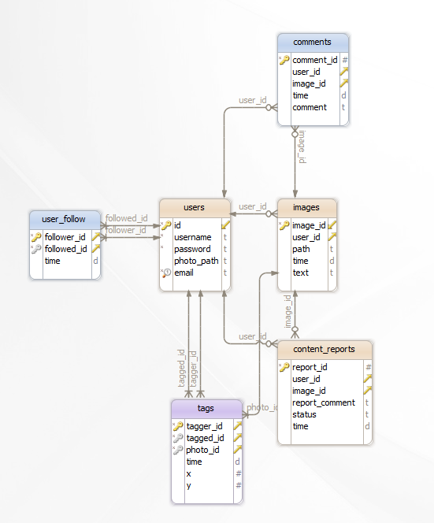

.. sectnum::
Parts Implemented by Sıddık Açıl
================================

	Comments, content reporting, and image tagging is implemented by me.

General Database Design
-----------------------

	ENTITY-RELATIONSHIP DIAGRAM OF MY PART

Comments
--------

Database Design
^^^^^^^^^^^^^^^

.. code-block:: sql

	CREATE TABLE IF NOT EXISTS comments (
		comment_id serial primary key,
		user_id int REFERENCES users(ID) ON DELETE CASCADE,
		image_id int REFERENCES images(image_id) ON DELETE CASCADE,
		time date,
		comment text
	);

Comments table has a serial primary key and two foreign keys, one to users table, other to images table. Users and images both has 1-n relation with comments, meaning that a user can make many comments and a images may have many comments made on.

Controller Code
^^^^^^^^^^^^^^^
.. code-block:: python
	
	from flask import Flask
	from flask import render_template, request, session
	from flask import Blueprint, current_app

	#declaring sub app with blueprint
	comment_app = Blueprint('comment_app', __name__)

	@comment_app.route('/comment/<image_id>',methods=["POST"])
	def comment(image_id):
		print("Hey")
		## insert
		comment = request.form['comment']
		with psycopg2.connect(current_app.config['dsn']) as conn:
		        crs=conn.cursor()
		        crs.execute("insert into comments (user_id, image_id, time, comment) values (%s, %s, now(), %s)", (session.get("user_id"), image_id, comment))
		        data = conn.commit()

		return render_template('message.html', message = "Successfully commented..")

	@comment_app.route('/comment_delete/<id>')
	def comment_delete(id):
		## delete
		#id = request.args.get('id')
		with psycopg2.connect(current_app.config['dsn']) as conn:
		        crs=conn.cursor()
		        crs.execute("delete from comments where comment_id = %s", (id))
		        data = conn.commit()

		return render_template('message.html', message = "Comment deleted..")

	@comment_app.route("/comment_update/<id>",methods=["POST"])
	def comment_update(id):
		new_comment = request.form["new_comment"]
		with psycopg2.connect(current_app.config["dsn"]) as conn:
		    crs = conn.cursor()
		    crs.execute('update comments set time=now(),comment=%s where comment_id=%s ',(new_comment,id))
		    conn.commit()

	return render_template("message.html",message="You have changed your comment successfully")

Content Reports
---------------

Database Design
^^^^^^^^^^^^^^^

.. code-block:: sql

	CREATE TABLE IF NOT EXISTS content_reports(
	    report_id serial primary key,
	    user_id INT REFERENCES users (ID) ON DELETE CASCADE,
	    image_id INT REFERENCES images (image_id) ON DELETE CASCADE,
	    report_comment text,
	    status text,
	    time date
	);

Controller Code
^^^^^^^^^^^^^^^

Image Tags
----------

Database Design
^^^^^^^^^^^^^^^

.. code-block:: sql

	CREATE TABLE IF NOT EXISTS tags(
	    tagger_id INT REFERENCES users (ID) ON DELETE CASCADE,
	    tagged_id INT REFERENCES users(ID) ON DELETE CASCADE,
	    photo_id INT REFERENCES images(image_id) ON DELETE CASCADE,
	    time date,
	    x INT,
	    y INT,
	    primary key (tagger_id,tagged_id,photo_id)
	);

Controller Code
^^^^^^^^^^^^^^^

