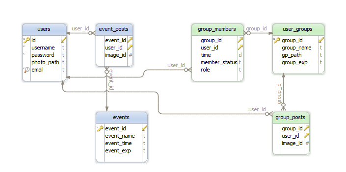

.. raw:: html

	

.. sectnum::

Parts Implemented by Rumeysa Bulut
==================================

User operations, event organizing, and creating groups is implemented by me.

General Database Design
-----------------------

	ENTITY-RELATIONSHIP DIAGRAM OF MY PART

User Operations
---------------

Database Design
^^^^^^^^^^^^^^^

.. code-block:: sql

	CREATE TABLE IF NOT EXISTS users(
        ID serial primary key,
        username VARCHAR(50) NOT NULL,
        password text NOT NULL,
        photo_path text,
        email text NOT NULL UNIQUE
    );

Users table has a serial primary key. This table is used by all members of the project.

Controller Code
^^^^^^^^^^^^^^^
.. code-block:: python

    from flask import Blueprint, current_app, render_template, request, session, redirect, url_for
    from passlib.hash import sha256_crypt
    register_app = Blueprint('register_app', __name__)

We used Flask's Blueprint interface. Blueprint simplifies large application works by seperating project into files.

.. code-block:: python

	@register_app.route('/signup', methods = ['POST'])
    def signup():
        data_username = request.form["username"]
        data_password = sha256_crypt.encrypt(request.form["password"])
        data_email = request.form["email"]
        print(data_password)
        with psycopg2.connect(current_app.config['dsn']) as conn:
            crs = conn.cursor()
            crs.execute("select username, email from users")
            data=crs.fetchall()
            for d in data:
                if d[0] == data_username:
                    return render_template('message.html', message="The username is already exists")
                elif d[1] == data_email:
                    return render_template('message.html', message="The email is already exists")

            crs.execute("insert into users (username, password, email) values (%s, %s, %s)",(data_username,data_password,data_email))
            conn.commit()

        return render_template('message.html', message="Successfully registered")

This register section gets user information from signup.html. It hashes the password, and checks user name and email whether they exists or not. If information satisfy the conditions, it adds the user to the database.
	* A disposable connection to database server is created via 'with' command which gets configuration from main application(current_app) settings.
	* Creates a cursor.
	* Executes an SQL selection.
    * Checks the data_username and data_email.
    * Executes an SQL insertion.
	* Commits the changes and save the result of the query.

If the conditions fail in the control stage or the insertion is done successfully, function returns a rendered template message.html which says the result of the user action.

.. code-block:: python

    @register_app.route('/login', methods=["POST"])
    def login():
        data_username = request.form["username"]
        data_password = sha256_crypt.encrypt(request.form["password"])

        with psycopg2.connect(current_app.config['dsn']) as conn:
            crs = conn.cursor()
            crs.execute("select ID from users where username = %s", (data_username, ))
            userid = crs.fetchone()

            if userid:
                crs.execute("select password, ID from users where username = %s", (data_username,))
                conn.commit()
                data = crs.fetchone()

            else:
                return render_template('message.html', message="Invalid Credentials")
            if (sha256_crypt.verify(request.form["password"],data[0])):
                session['logged_in'] = True
                session['user_id'] = data[1]
                return redirect(url_for('home_page'))
            else:
                return render_template('login.html')

 Login section proceeds in a similar way to sign up operation. It controls the username and password are registered.
    * Creates a cursor.
    * Executes an SQL select to check the user is registered before.
    * If user is in the database, it gets the password and checks it.
    * Makes session changes.
The function returns the necessary pages under certain conditions. If username fails, a message says "Invalid Credentials" will be appear. If password fails, returns back to the login page. If entered information is true, directs users to the home page.

.. code-block:: python

    @register_app.route('/update_user',methods=["POST"])
    def updateUser():
        id=session['user_id']
        data_username = request.form["username"]
        data_password = sha256_crypt.encrypt(request.form["password"])
        data_email = request.form["email"]

        with psycopg2.connect(current_app.config['dsn']) as conn:
            crs = conn.cursor()
            crs.execute("update users set username=%s, password=%s,email=%s where ID = %s",(data_username,data_password,data_email,id))

        return render_template('message.html',message="Successfully updated")

This register section gets user information from update.html. If users want to update their information, this function gets current information from the form and the user ID from session.
    * The function connects to database driver.
    * Creates a cursor
    * Executes an SQL update with id.
    * Commits the changes to the database.
Then returns a "message.html" template which says "Successfully updated."

.. code-block:: python

    @register_app.route('/remove_user',methods=["POST"])
    def removeUser():
        data_username = request.form["username"]
        with psycopg2.connect(current_app.config['dsn']) as conn:
            crs = conn.cursor()
            crs.execute("delete from users where username = %s",(data_username,))
            data = conn.commit()

        return render_template('login.html')

Deleting an account almost follows the same process with update section.
    * The function connects to database driver.
    * Creates a cursor.
    * Executes an SQL delete with username.
    * Commits the changes to the database.
The returns to the login page.

User Groups
-----------

Database Design
^^^^^^^^^^^^^^^

.. code-block:: sql

    CREATE TABLE IF NOT EXISTS user_groups(
        group_id serial primary key,
        group_name text,
        gp_path text,
        group_exp text
    );

Controller Code
^^^^^^^^^^^^^^^

Image Tags
----------

Database Design
^^^^^^^^^^^^^^^

.. code-block:: sql

	CREATE TABLE IF NOT EXISTS events(
        event_id serial primary key,
        event_name text,
        event_time text,
        event_exp text
    );

Controller Code
^^^^^^^^^^^^^^^

