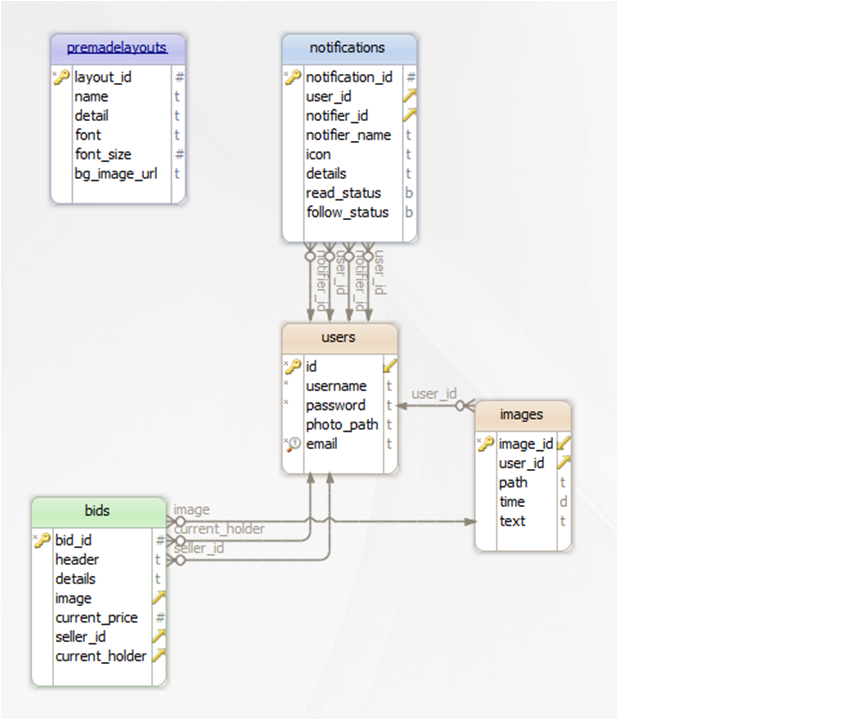

.. raw:: html

	

Parts Implemented by Halit Uyanık
=================================

Includes notification, bidding and premadelayout pages.

General Database Design
-----------------------

Entities and Relations Graph

Blueprint
---------

Blueprint is used for all methods and applications in pages. Below you can see an example of creating a new app.

An example blueprint in name 'notific_app' is created. This is used in server.py and eventually in html itself to call python functions. 

.. code-block:: python
	
	notific_app = Blueprint('notific_app', __name__)

Notifications
-------------

Database Design
^^^^^^^^^^^^^^^

Notifications table includes primary key, two foreign keys for the users table. If a user is removed from the database then his/her notifications will also get removed.

.. code-block:: sql

	CREATE TABLE IF NOT EXISTS notifications(
		notification_id serial primary key,
		user_id int REFERENCES users(ID) ON DELETE CASCADE,
		notifier_id int REFERENCES users(ID) ON DELETE CASCADE,
		notifier_name text,
		icon text,
		details text,
		read_status boolean,
		follow_status boolean
	);

Controller Code
^^^^^^^^^^^^^^^

Notification pages uses 2 methods from controller.
	
	* Notification_delete_
	* Status_update_

Notification_delete
~~~~~~~~~~~~~~~~~~~

Notification_delete controller has an id parameter which is used to delete an existing notification from the server. After the operation is done user is directed to a message page.

.. code-block:: python

	@notific_app.route('/notification_delete/<id>')
	def notification_delete(id):
		with psycopg2.connect(current_app.config['dsn']) as conn:           
				crs=conn.cursor()
				crs.execute("delete from notifications where notification_id = %s", (id))
				data = conn.commit()
		
		return render_template('message.html', message = "Notification deleted..")

Status_update
~~~~~~~~~~~~~

Status_update controller has no parameter and a 'GET' method. It is invoked from user interface and takes the id and stat values from html request. Then according to the value of stat it updates the notification's status with that id to either TRUE or FALSE. 

.. code-block:: python

	@notific_app.route('/status_update/', methods = ['GET'])
	def status_update():
		id = request.args.get('id')
		stat = request.args.get('status')
		with psycopg2.connect(current_app.config['dsn']) as conn:           
				crs=conn.cursor()
				if stat == "False":
					crs.execute("update notifications set read_status = TRUE where notification_id = %s", (id))
				elif stat == "True": 
					crs.execute("update notifications set read_status = FALSE where notification_id = %s", (id))
				data = conn.commit()
		
		return render_template('message.html', message = "Notification status updated..")	

Bidding
-------

Database Design
^^^^^^^^^^^^^^^

Bids table includes a serial primary key, 3 references; 2 to users table and 1 to images table. Bid name and details are stored in text column. Current bidded price is stored in numerical form. If the image for the bid is removed from the server, then the bidding will no longer exist. Also a user cannot remove his/her account without removing their bidding first.

.. code-block:: sql

	CREATE TABLE IF NOT EXISTS bids(
		bid_id serial primary key,
		header text,
		details text,
		image int REFERENCES images(image_id) ON DELETE CASCADE,
		current_price numeric,
		seller_id int REFERENCES users(ID) ON DELETE RESTRICT,
		current_holder int REFERENCES users(ID) ON DELETE RESTRICT
	);

Controller Code
^^^^^^^^^^^^^^^

Bidding page includes three controller:
	
	* Add_new_bid_
	* Update_bid_
	* Delete_bid_

Add_new_bid
~~~~~~~~~~~

Add_new_bid is a function which is used for POST methods. It takes new bids from the user interface as form info, processes these data, saves the image to server as both physical file and database info, then inserts the new bid into the database.

.. code-block:: python

	@bidding_app.route('/add_new_bid/', methods = ['POST'])
	def add_new_bid():
		name = request.form['item_name']
		details = request.form['description']
		image = request.files['image']
		price = request.form['price']
		seller_id = session['user_id']
		current_holder = session['user_id']

		image.save(os.path.join('static/uploads', image.filename))
		
		with psycopg2.connect(current_app.config['dsn']) as conn:    
				crs=conn.cursor()
				crs.execute("insert into images (user_id, path, time, text) values (%s, %s, now(), %s) RETURNING image_id", (2, image.filename, details))
				im_id = crs.fetchone()
				#print(im_id[0])
				crs.execute("insert into bids (header, details, image, current_price, seller_id, current_holder) values (%s, %s, %s, %s, %s, %s)", (name, details, im_id[0], price, seller_id, current_holder))
				conn.commit()

		return render_template('message.html', message = "Bid Successfully Added!")

Update_bid
~~~~~~~~~~

Has one parameter <id>, and is used for 'POST' method. Takes the new price from form and checks the current price of the item. If the old price is higher the request is invalid, otherwise the bid is updated with the new entered one.

.. code-block:: python

	@bidding_app.route('/update_bid/<id>', methods = ['POST'])
	def update_bid(id):
		new_price = request.form['price']
		with psycopg2.connect(current_app.config['dsn']) as conn:

			crs=conn.cursor()
			crs.execute("select current_price from bids where bid_id=%s", (id))
			data = crs.fetchone()

			if data[0] > float(new_price):
				return render_template('message.html', message = "You need to bid a higher price from current one!")

			crs.execute("update bids set current_price=%s, current_holder=%s where bid_id=%s",(new_price, session['user_id'], id))
			conn.commit()

		return render_template('message.html', message = "You bid successfully applied!")

Delete_bid
~~~~~~~~~~

Has one parameter <id>, removes the bidding from database.

.. code-block:: python

	@bidding_app.route('/delete_bid/<id>')
	def delete_bid(id):
		with psycopg2.connect(current_app.config['dsn']) as conn:
			crs=conn.cursor()
			crs.execute("delete from bids where bid_id=%s",(id))
			conn.commit()
		return render_template('message.html', message = "Your bid is successfully removed!")    

Premadelayout
-------------

Database Design
^^^^^^^^^^^^^^^

.. code-block:: sql

	CREATE TABLE IF NOT EXISTS premadelayouts(
		layout_id serial primary key,
		name text,
		detail text,
		font text,
		font_size int,
		bg_image_url text
	);

Premadelayout table includes a serial primary key, 4 text columns for name, detail, font, and background image url. Font-size is stored in int format. This table is prepared to be more flexible for the user at session level so there is no foreign keys in it.

Controller Code
^^^^^^^^^^^^^^^

Premadelayout page includes 4 methods from its app.
	
	* Add_new_layout_
	* Layout_delete_
	* Layout_update_
	* Layout_change_

Add_new_layout
~~~~~~~~~~~~~~

When a user wants to add a new bid and fills the form following method is called in server. It requires to be a 'POST' method. 

Form variables are taken, then inserted into the database. After that user is shown an operation message.

.. code-block:: python

	@layout_app.route('/add_new_layout/', methods = ['POST'])
	def add_new_layout():
		name = request.form['name']
		details = request.form['detail']
		font = request.form['font_name']
		font_size = request.form['font_size']
		bg_image = request.form['image_url']

		with psycopg2.connect(current_app.config['dsn']) as conn:    
				crs=conn.cursor()
				crs.execute("insert into premadelayouts (name, detail, font, font_size, bg_image_url) values (%s, %s, %s, %s, %s)", (name, details, font, font_size, bg_image))
				conn.commit()

		return render_template('message.html', message = "Layout Successfully Added!")

Layout_delete
~~~~~~~~~~~~~

User sends the id of the layout they wish to delete to this method, and the respective layout is deleted from database.

.. code-block:: python

	@layout_app.route('/layout_delete/<id>')
	def layout_delete(id):
		with psycopg2.connect(current_app.config['dsn']) as conn:           
				crs=conn.cursor()
				crs.execute("delete from premadelayouts where layout_id = %s", (id))
				data = conn.commit()
		
		return render_template('message.html', message = "Layout deleted..")

Layout_update
~~~~~~~~~~~~~

Layout update works similarly to layout insertion, the variables are taken from the user as a form and those values are processed in the method with updating the layout via its id.

.. code-block:: python

	@layout_app.route('/layout_update/<id>', methods = ['POST'])
	def layout_update(id):
		name = request.form['name']
		details = request.form['detail']
		font = request.form['font_name']
		font_size = request.form['font_size']
		bg_image = request.form['image_url']

		with psycopg2.connect(current_app.config['dsn']) as conn:           
				crs=conn.cursor()
				crs.execute("update premadelayouts set name=%s, detail=%s, font=%s, font_size=%s, bg_image_url=%s where layout_id=%s",(name, details, font, font_size, bg_image, id))
				conn.commit()
		
		return render_template('message.html', message = "Layout updated..")

Layout_change
~~~~~~~~~~~~~

Rather then making a change in database, layout change takes the id of the user selected layout, pulls it from the database and inserts the information to session of the user.

.. code-block:: python

	@layout_app.route('/layout_change/', methods = ['POST'])
	def layout_change():
		lay_id = request.form['layout']
		with psycopg2.connect(current_app.config['dsn']) as conn:           
			crs=conn.cursor()
			crs.execute("select * from premadelayouts where layout_id = %s", (lay_id))
			data = crs.fetchone()
			session['bimg'] = data[5]
			session['font'] = data[3]
			session['font-size'] = data[4]
			conn.commit()
		return render_template('message.html', message = "Layout Changed.")