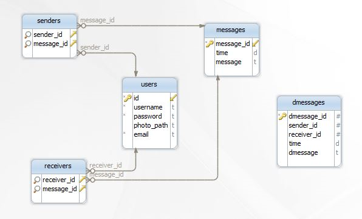

.. raw:: html

   

Parts Implemented by Ömer Faruk İNCİ
====================================

Sending message to a specific user and direct message is implemented by me.

General Database Design
-----------------------

   ENTITY-RELATIONSHIP DIAGRAM OF MY PART

Sending message to a specific user
----------------------------------

Database Design
^^^^^^^^^^^^^^^

.. code-block:: sql

   CREATE TABLE IF NOT EXISTS messages (
    message_id serial primary key,
    time date,
    message text
   );

   CREATE TABLE IF NOT EXISTS senders (
       sender_id int REFERENCES users (ID) ON DELETE CASCADE,
       message_id int REFERENCES messages (message_id) ON DELETE CASCADE
   );

   CREATE TABLE IF NOT EXISTS receivers (
       receiver_id int REFERENCES users (ID) ON DELETE CASCADE,
       message_id int REFERENCES messages (message_id) ON DELETE CASCADE
   );

Message table has a serial primary key called message_id. Senders and receivers tables refenrece messages and users tables.

Controller Code
^^^^^^^^^^^^^^^
.. code-block:: python

   import os
   import psycopg2
   from flask import Flask
   from flask import render_template, request
   from flask import Blueprint, current_app

   gmessage_app = Blueprint('gmessage_app', __name__)

Blueprint interface is used for this project. Blueprint make development easier by having the ability of separating the project into varied files.

.. code-block:: python

   @gmessage_app.route('/gmessage',methods=["POST"])
   def gmessage():
       gmessage = request.form['gmessage']
       sender = request.form['senders']
       receiver = request.form['receivers']
       with psycopg2.connect(current_app.config['dsn']) as conn:
               crs=conn.cursor()
               crs.execute("insert into messages (time, message) values (now(), %s)RETURNING message_id", (gmessage,))
               m_id = crs.fetchone()[0]
               crs.execute("select ID from users where username=%s", (sender,))
               sndr_id = crs.fetchone()
               crs.execute("insert into senders (sender_id, message_id) values (%s, %s)", (sndr_id,m_id))
               crs.execute("select ID from users where username=%s", (receiver,))
               rcvr_id = crs.fetchone()
               crs.execute("insert into receivers (receiver_id, message_id) values (%s, %s)", (rcvr_id,m_id))
               data = conn.commit()

       return render_template('message.html', message = "Message has been sent.")

This function is for sending message to a specific user. After getting the message, sender and receiver info, it adds their information to database.For getting the id of user by giving its name, SQL selection is used.
  
   * A disposable connection to database server is created via 'with' command which gets configuration from main application(current_app) settings.
   * Creates a cursor.
   * Insert into messages table.
   * Executes an SQL insertion.
   * Executes an SQL selection.
   * Commits the changes and save the result of the operation.

If the function runs properly, rendered template message.html is returned with the information of result of action.

.. code-block:: python

   @gmessage_app.route('/gmessage_delete/<id>')
   def gmessage_delete(id):
       with psycopg2.connect(current_app.config['dsn']) as conn:
               crs=conn.cursor()
               crs.execute("delete from messages where message_id = %s", (id))
               crs.execute("delete from senders where message_id = %s", (id))
               crs.execute("delete from receivers where message_id = %s", (id))
               data = conn.commit()

       return render_template('message.html', message = "Message has been deleted.")

This function deletes the message, sender and the reciever information from the messages, receivers and senders table with given message id.
  
   * The function connects to the database.
   * Creates a cursor.
   * Delete from messages, senders and receivers table.
   * Commits the changes to the database.

If the function runs properly, rendered template message.html is returned with the information of result of action.

.. code-block:: python

   @gmessage_app.route("/gmessage_update/<id>",methods=["POST"])
   def gmessage_update(id):
       updated_gmessage = request.form["new_gmessage"]
       with psycopg2.connect(current_app.config["dsn"]) as conn:
           crs = conn.cursor()
           crs.execute('update messages set time=now(),message=%s where message_id=%s ',(updated_gmessage,id))
           conn.commit()

       return render_template("message.html",message="Message has been updated.")

Uploading a message is enabled by this function with the given message id.
   
   * The function connects to the database.
   * Creates a cursor.
   * Executes an SQL update with message id.
   * Commits the changes to the database.

If the function runs properly, rendered template message.html is returned with the information of result of action.

Direct Messages
---------------

Database Design
^^^^^^^^^^^^^^^

.. code-block:: sql

   CREATE TABLE IF NOT EXISTS directmessages (
       dmessage_id serial primary key,
       sender_id int,
       receiver_id int,
       time date,
       dmessage text
   );

Controller Code
^^^^^^^^^^^^^^^

.. code-block:: python

   @app.route('/dmessage')
   def dmessage():
       if session.get('logged_in')== None:
           return redirect(url_for("loginpage"))
       with psycopg2.connect(app.config['dsn']) as conn:
           crs=conn.cursor()
           crs.execute("select * from directmessages order by time desc")
           dmessages = crs.fetchall()

       now =datetime.datetime.now()

       return render_template('dmessage.html', current_time=now.ctime(), dmessage_app = dmessage_app, dmessage_list=dmessages)

This function routes the dmessage page and it also sends some data to the dmessage page.
  
   * Function looks at the seesion to see if the user is logged in or not.
   * If user is logged in, it connects to the database.
   * Creates a cursor.
   * Executes an SQL select query to list the followed users.

Finally, it redirects to the dmessage.html.

.. code-block:: python

   @dmessage_app.route('/dmessage',methods=["POST"])
   def dmessage():
       dmessage = request.form['dmessage']
       with psycopg2.connect(current_app.config['dsn']) as conn:
               crs=conn.cursor()
               crs.execute("insert into directmessages (sender_id, receiver_id, time, dmessage) values (%s, %s, now(), %s)", (1, 2, dmessage))
               data = conn.commit()

       return render_template('message.html', message = "Message has been sent.")

This function adds a new message with the information of sender id, receiver id and the time.
   
   * It requests message info from the dmessage.html
   * Then connects to the database and also generates a cursor.
   * Inserts the message to the directmessages table.
   * Commits the changes to the database.

If the function runs properly, rendered template message.html is returned with the information of result of action.

.. code-block:: python

   @dmessage_app.route('/dmessage_delete/<id>')
   def dmessage_delete(id):
       with psycopg2.connect(current_app.config['dsn']) as conn:
               crs=conn.cursor()
               crs.execute("delete from directmessages where dmessage_id = %s", (id))
               data = conn.commit()

       return render_template('message.html', message = "Message has been deleted.")

This function deletes the existing message with given message id.
  
   * It connects to the database and also generates a cursor.
   * Deletes the message from directmessages table.
   * Commits the changes to the database.

If the function runs properly, rendered template message.html is returned with the information of result of action.

.. code-block:: python

   @dmessage_app.route("/dmessage_update/<id>",methods=["POST"])
   def dmessage_update(id):
       updated_dmessage = request.form["new_dmessage"]
       with psycopg2.connect(current_app.config["dsn"]) as conn:
           crs = conn.cursor()
           crs.execute('update directmessages set time=now(),dmessage=%s where dmessage_id=%s ',(updated_dmessage,id))
           conn.commit()

    return render_template("message.html",message="Message has been updated.")

This function updates the existing message with given message id.
 
   * It connects to the database and also generates a cursor.
   * Updates the message from directmessages table.
   * Commits the changes to the database.
   
If the function runs properly, rendered template message.html is returned with the information of result of action.
