Parts Implemented by Sıddık Açıl
================================

Comments
--------

How to comment?
~~~~~~~~~~~~~~~

To comment click and fill the area below and press "Comment!" button.

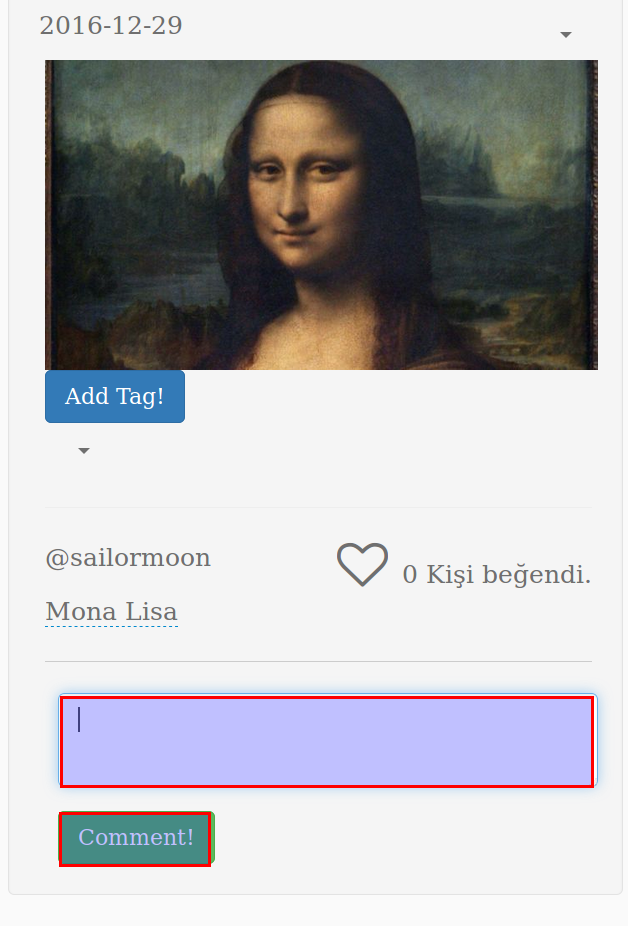

Your comment can be viewed under the image.

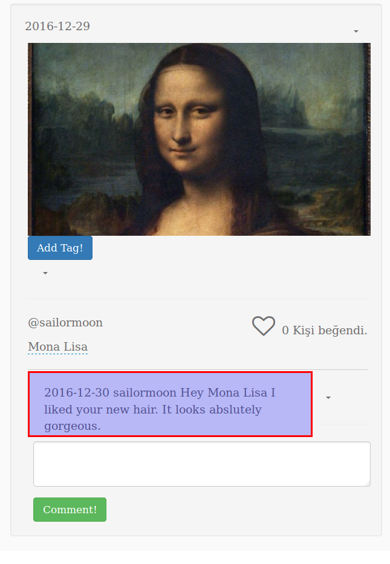

How to edit comments?
~~~~~~~~~~~~~~~~~~~~~

If you have made a mistake while commenting or if you want to add something more you can click the caret next to your comment and click  "Edit"

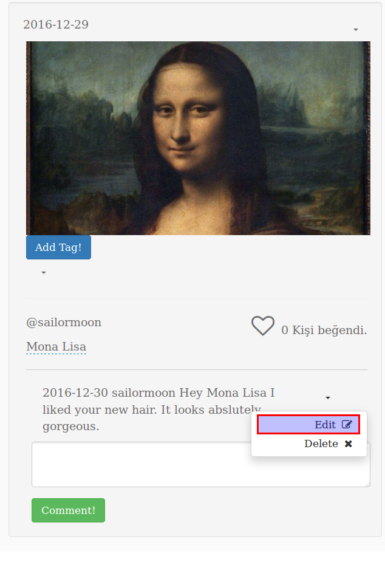

You can edit your comment in the input field and press "Edit!" button to save changes.

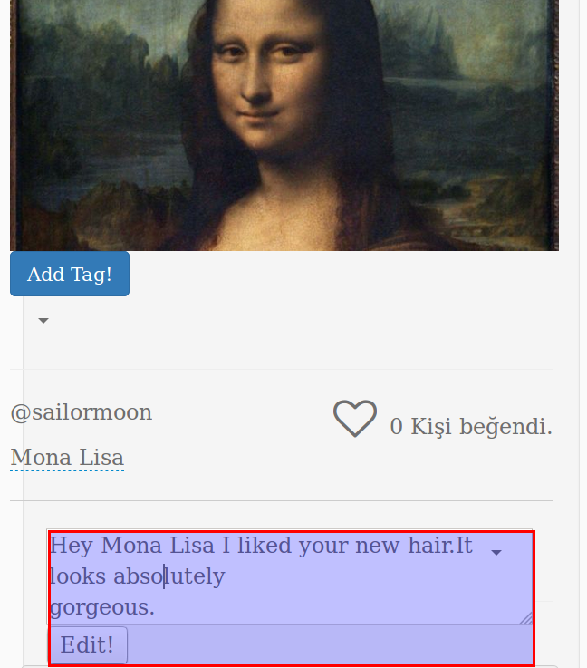

Your comment after the update.

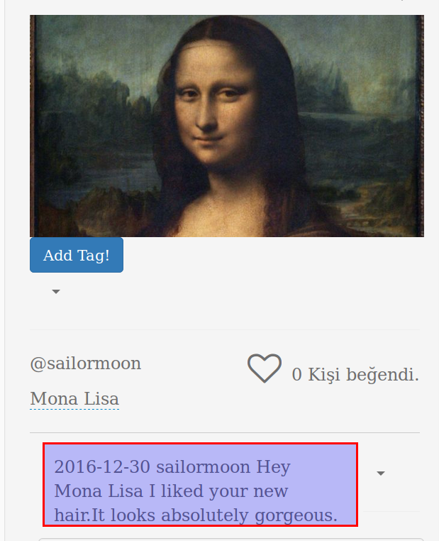

How to delete comments?
~~~~~~~~~~~~~~~~~~~~~~~

If you want to delete a comment you have made click the caret next to your comment and click "Delete".

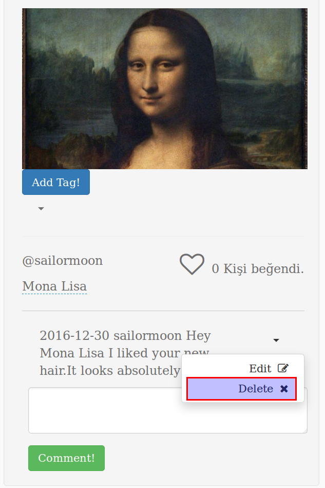

Viola! Your comment is gone.

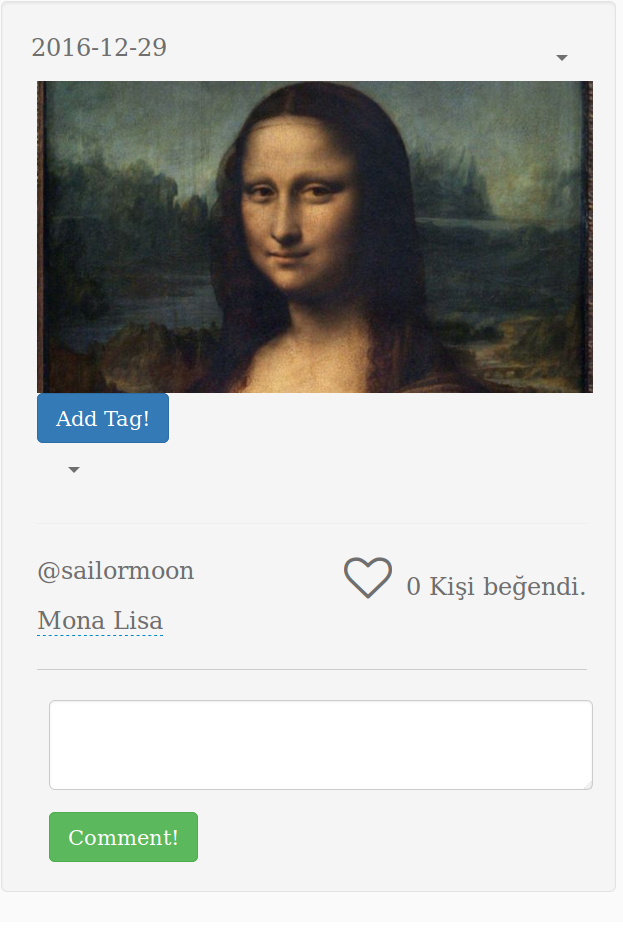

Reporting Content
-----------------

How to report a content?
~~~~~~~~~~~~~~~~~~~~~~~~

If you find a content unsuitable, you can issue a proposal for deletion by clicking the caret on upper right side of an image then click "Report".

Image Tagging
-------------

How to tag someone to an image?
~~~~~~~~~~~~~~~~~~~~~~~~~~~~~~~

If you want to tag someone (including yourself) to an image, click the "Add Tag!" button beneath image.

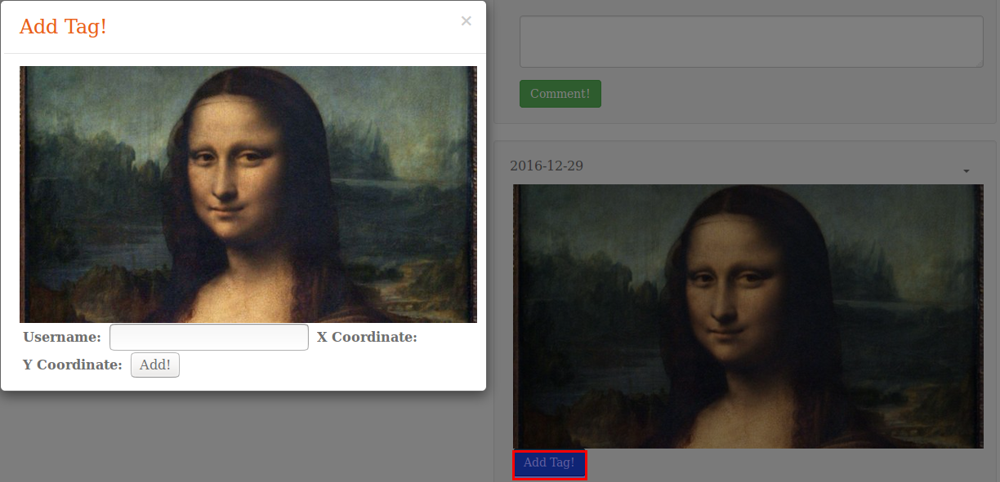

Fill in the name you want to tag and click the position you want to tag the name.

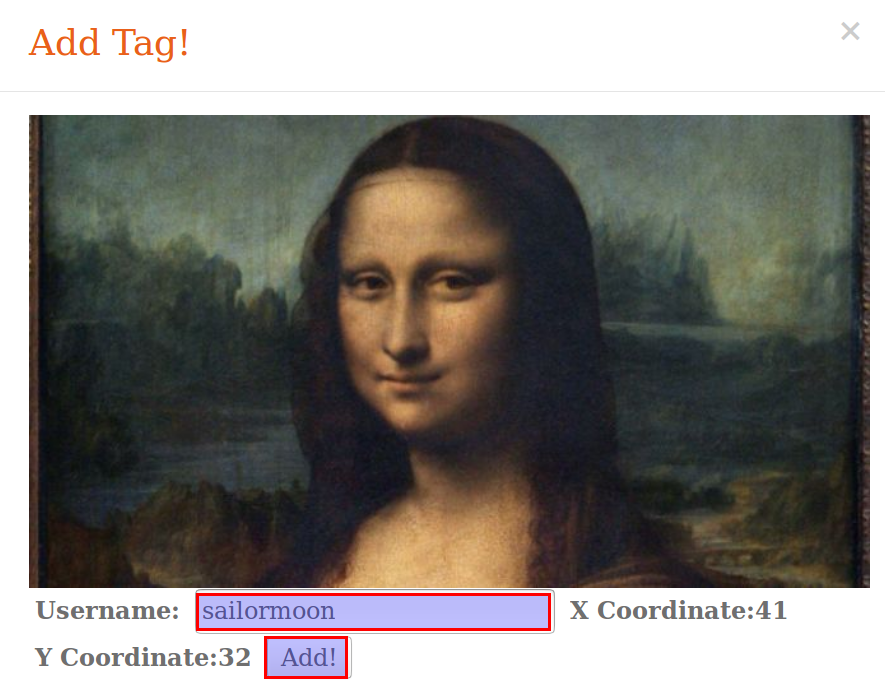

You can view tags of an image by clicking the caret under "Add Tag!" button.

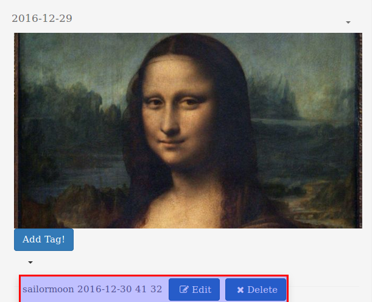

I am tagged to a photo. How do I update this tag?
~~~~~~~~~~~~~~~~~~~~~~~~~~~~~~~~~~~~~~~~~~~~~~~~~

When you click the caret to show the tags of and image, you will find "Edit" button next to tags. If you want to update tag from photo click "Edit".

Fill the form on the pop-up and click a new place on image if you want to, then press update.

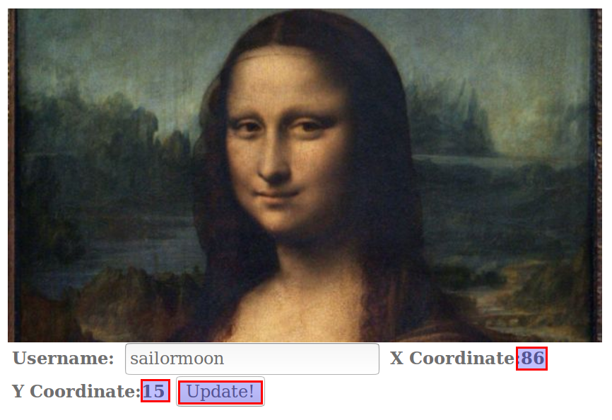

Your changes has been saved.

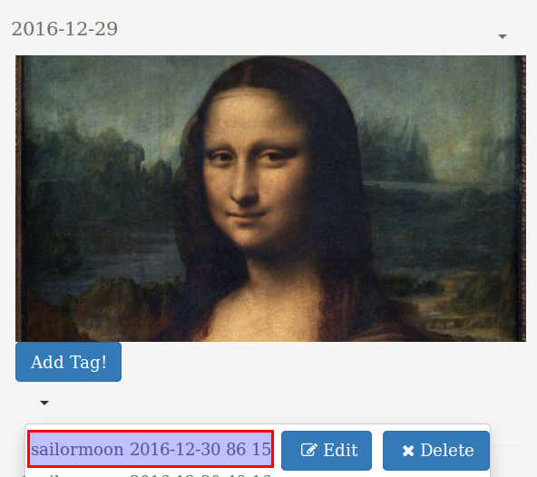

I am tagged to a photo. How do I delete this tag?
~~~~~~~~~~~~~~~~~~~~~~~~~~~~~~~~~~~~~~~~~~~~~~~~~

When you click the caret to show the tags of and image, you will find "Delete" button next to tags. If you want to remove tag from photo click "Delete".

A pop-up will show to make sure you want to remove the tag.

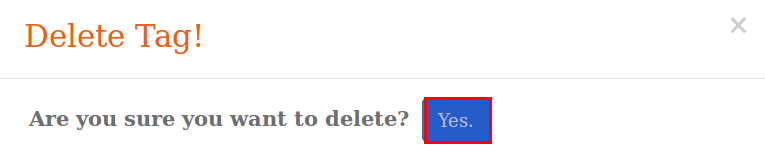

.. note:: You can only delete/edit tags if you are the user who is tagged.

User Listing
------------

How to search someone?
~~~~~~~~~~~~~~~~~~~~~~

On the top of the page fill in the "Search" field and press enter.

Your search result is.

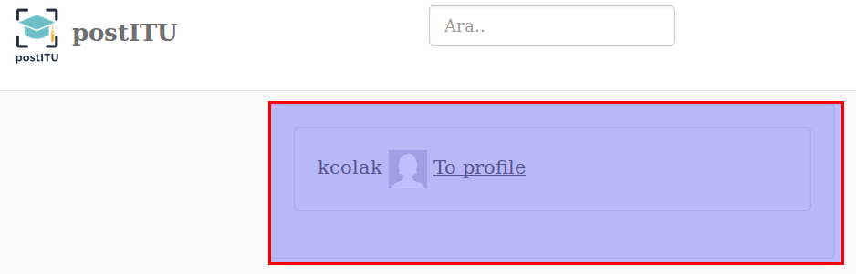

Following Users
---------------

How to view followers?
~~~~~~~~~~~~~~~~~~~~~~

Click on "Followers" link to view the list of your followers.

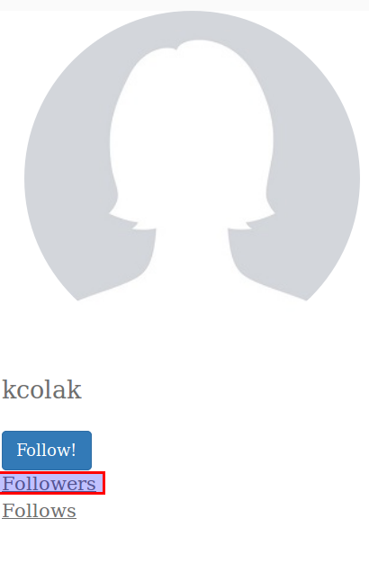

How to view people I follow?
~~~~~~~~~~~~~~~~~~~~~~~~~~~~

Click on "Follows" link to view the list of the people you follow.

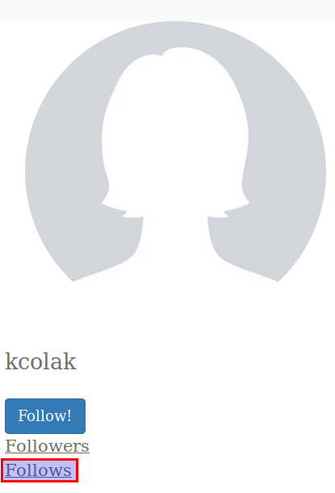
