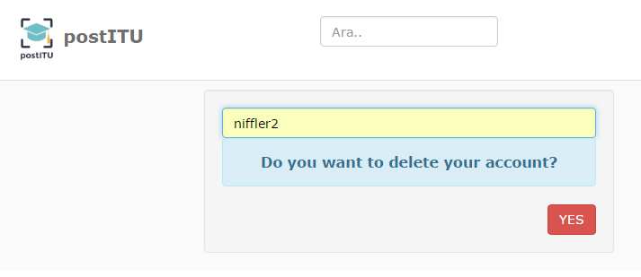

Parts Implemented by Rumeysa Bulut
==================================

User Operations
---------------

How can I register?
~~~~~~~~~~~~~~~~~~~

When you open the site, you will see the login page first. There is an option for registering under the login section. If you do not have an account, you can click that arrow sign to reach the sing up page. Also, you can click the dropdown menu, and you will see an icon to direct you to the register page.

Here is a view of register page:

How can I login?
~~~~~~~~~~~~~~~~

When you open the site, you will see the login page first. You can enter to the site easily by typing your user name and password.
Here is a view of login page:

How can I remove my account?
~~~~~~~~~~~~~~~~~~~~~~~~~~~~

You will see an option which allows you to remove your account on the dropdown menu after you logged in. if you click the cross sign, you will be directed to the remove account page. You can remove your account simply by typing your user name and pressing “yes”.
Here is a view of remove account page:

How can I update my information?
~~~~~~~~~~~~~~~~~~~~~~~~~~~~~~~~

Update account section follows similar steps to removing account section. You will see an option which allows you to update your information on the dropdown menu after you logged in. if you click the refresh sign, you will be directed to the update account page. You can enter your current information to the form in this page.
Here is a view of update account page:

User Groups
-----------

How can I create a group and add participants to it?
~~~~~~~~~~~~~~~~~~~~~~~~~~~~~~~~~~~~~~~~~~~~~~~~~~~~

Creating group feature is activated after you logged in. The new group link will be appear on the dropdown menu when you logged in. By clicking that button, you will be directed to the create group page. You can create groups with the people you followed. You can give a name and a description to your group. When you press “save” button, your group will be created.
Here is a view of creating group page:

How can I update the group information?
~~~~~~~~~~~~~~~~~~~~~~~~~~~~~~~~~~~~~~~

There will be a green group icon on the dropdown menu that is activated after you logged in. When you press it, you can list the all groups that you created. There are two signs near the group name. The pencil icon represents the update function. You can update your group name and description by clicking that icon.
Here is a view of the page that lists all groups:

.. image:: member2img/update_group.png

How can I delete a group?
~~~~~~~~~~~~~~~~~~~~~~~~~

Almost the same process with updating are valid in the removing section. Firstly, you should list all the groups, and click the cross sign near the name. Your group will be deleted.
Here is a view to show you to deletion:

Events
------

How can I create an event?
~~~~~~~~~~~~~~~~~~~~~~~~~~

This feature is also activated after logging in. There is an icon for creating events. If you click that icon, you will go to the page where you can create your event easily.
Here is a view of the creating event page:

How can I update an event's information?
~~~~~~~~~~~~~~~~~~~~~~~~~~~~~~~~~~~~~~~~

You should list all events to update them as in the update group section. You can list all events by clicking the green calendar icon on the dropdown menu. Then, you can update the event’s information by pressing the pencil icon.
Here is some screen pictures of the update event page:

How can I delete an event?
~~~~~~~~~~~~~~~~~~~~~~~~~~

As in the update event section, you should follow almost the same steps. After you listed all events, you can delete them by clicking the cross icon.
	Here is the page that lists all groups and shows the cross sign:

.. image:: member2img/event_delete.png

