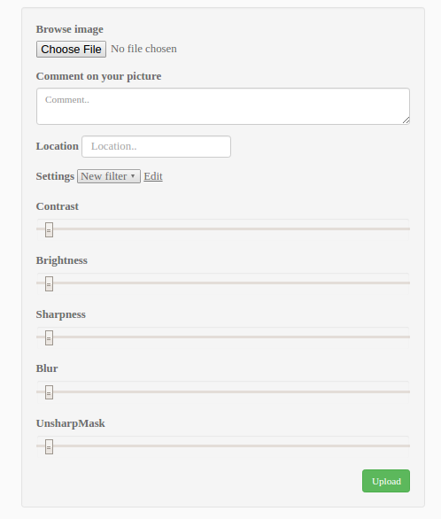
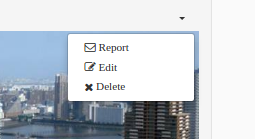
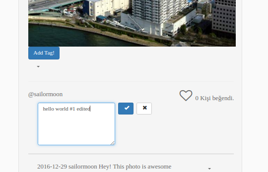
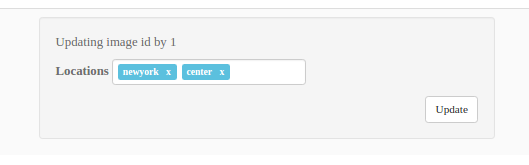
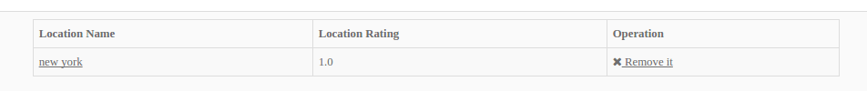
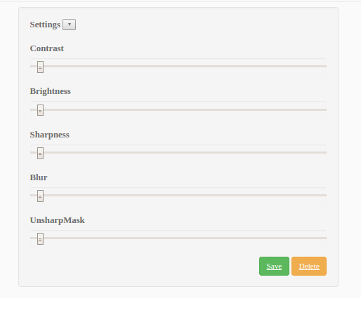

.. sectnum::

Parts Implemented by Alim Özdemir
=================================

All url relative to bluemix link (http://itucsdb1621.mybluemix.net/)

Image Operations
----------------

How can I upload ?
~~~~~~~~~~~~~~~~~~

Users can upload images via */upload*. This is the main part of the site, almost all thing based on this feature.

How can I delete ?
~~~~~~~~~~~~~~~~~~

The dropdown menu at an image box. Click "x Delete" button.

How can I update ?
~~~~~~~~~~~~~~~~~~

If you are the owner of that image, you can click the description of the image and edit it.

Location Operations
-------------------

How can I add locations into a image ?
~~~~~~~~~~~~~~~~~~~~~~~~~~~~~~~~~~~~~~

At image uploading screen, there exists location input that you can insert multiple locations.

How can I edit and delete locations ?
~~~~~~~~~~~~~~~~~~~~~~~~~~~~~~~~~~~~~

The dropdown menu at an image box. Click " Edit" button. Same functionality as adding locations.

List of All locations
~~~~~~~~~~~~~~~~~~~~~

You can list all locations via */locations*.

Filter Operations
-----------------

How can I apply a filter to image ?
~~~~~~~~~~~~~~~~~~~~~~~~~~~~~~~~~~~

At image uploading screen, there exists filter settings that you can apply a filter to image.

How can I manage my filter settings ?
~~~~~~~~~~~~~~~~~~~~~~~~~~~~~~~~~~~~~

You can manage your filters via */filter/index*

