Parts Implemented by Halit Uyanık
=================================

Bidding
-------

Bidding page provides users to show their own works to gather interest of others and earn some money from it. This is a nice place for talented people to show their powerful works.

Bid page can be accessed via:

http://itucsdb1621.mybluemix.net/bidPage

How to Create a New Bidding?
~~~~~~~~~~~~~~~~~~~~~~~~~~~~

In the bid page you will see a link on top of the page called "New Bid" just under the "Market Place" header.

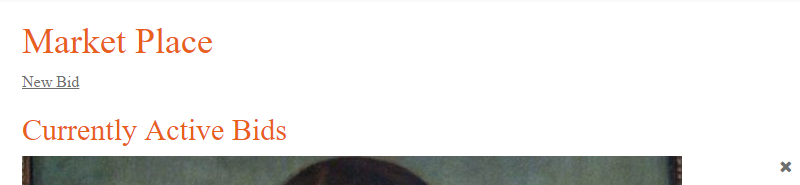

After clicking the link you will be directed to bid form page, with header "Place a new item on Market"

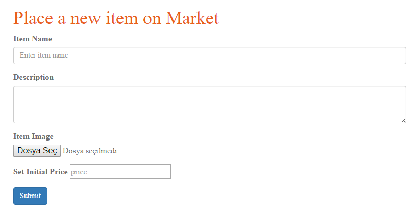

After filling the Item Name, Description, choosing an image, and setting a new price with a limitation that you cant go beyond 2 zeros after .0 (0.00), click the submit button.

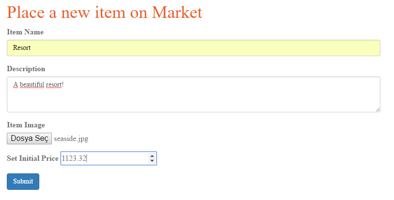

You successfully added your new bid to market!

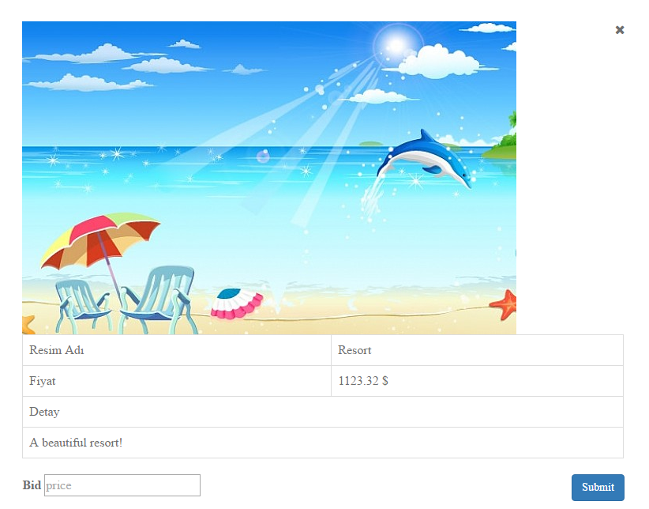

How to Bid to an existing bid?
~~~~~~~~~~~~~~~~~~~~~~~~~~~~~~

At the bid page you may see one or more bids which you can bid more money from the current price.

You will be able to see an area under the image information, where there is one input area, and a button.

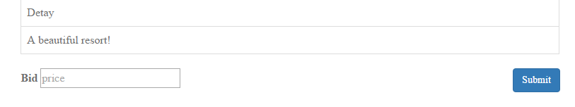

There you need to enter a number higher then the current price (or you will recieve an error message!) and click submit button.

After successfully submitting you will see that you new price is active on the image.

Before change:

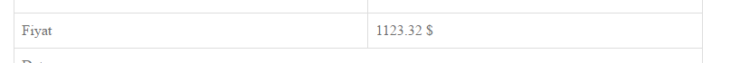

After change:

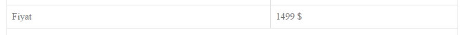

How to remove a bid from market?
~~~~~~~~~~~~~~~~~~~~~~~~~~~~~~~~

At the bid page near an existing bid you will be able to see a 'x' button as below.

If you click the button the bid will be removed from the market.

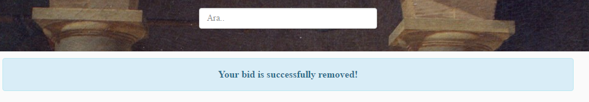

.. WARNING:: Since it is logical to sell an item which exists on the website. If you delete an image from your main page, the associated bid for that image will also be removed!!

Layout Change
-------------

Layout changing is focused on users session, and it is an open system for all users to share their created layouts directly.

Layout changing is focused on header background image change, font of the website (as defined in layout.html), and the font-size of the website in percentage unit.

The link for the layout operations is:

http://itucsdb1621.mybluemix.net/changeLayout

How to Create a New Layout?
~~~~~~~~~~~~~~~~~~~~~~~~~~~

At the layout page. Below the existing layouts section there exists a second part called "Or You Can Share A New Layout With Others". Here you can enter the information about your new layout, all fields are required, then submit it!

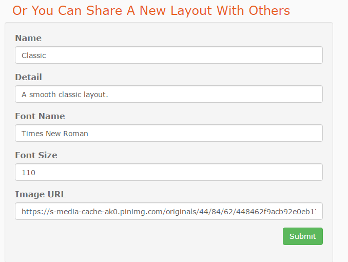

After that you will see that your new layout is added to list.

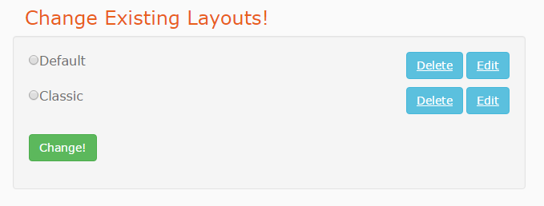

How to Change The Default Layout?
~~~~~~~~~~~~~~~~~~~~~~~~~~~~~~~~~

After going to the layout change page, at top you will see a header "Change Existing Layouts!". There you can choose one of the layouts with radio buttons then click the green 'Change!' button at bottom left.

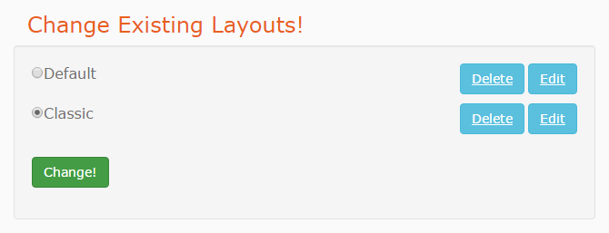

You will notice that you layout is changed at the success message page.

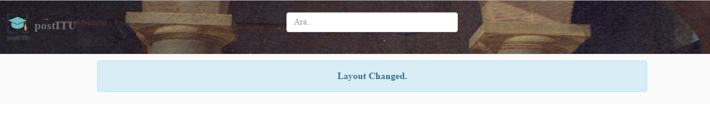

How to Edit Existing Layouts?
~~~~~~~~~~~~~~~~~~~~~~~~~~~~~

At the layout page. In "Change Existing Layouts!" section, there are two buttons near a layout option. One of them is 'Edit'. Click the button.

After clicking you will be directed to the layout editing page. The default values are the ones for that layout, and you are "*required*" to fill all the areas.

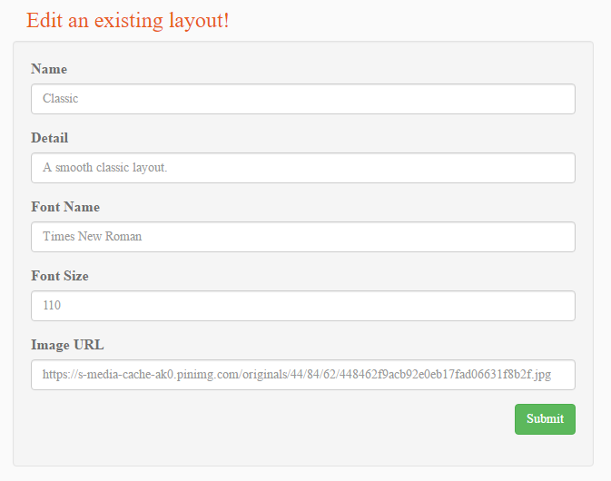

After filling all the information and sending the form info, you have successfully changed the layout!

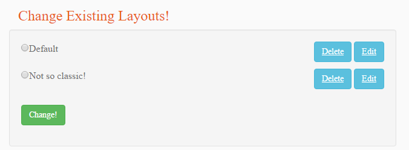

How to Delete Existing Layouts?
~~~~~~~~~~~~~~~~~~~~~~~~~~~~~~~

At the layout page in "Change Existing Layouts!" section, you can see the "Delete" button near an option.

After clicking delete the layout will be deleted from the page.

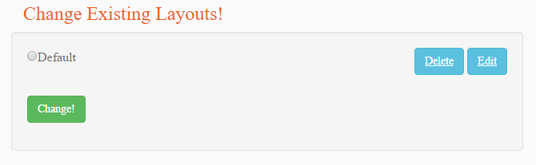

Notifications
-------------

Notifications are implemented as a way for user to see new notifications when a user uploads an image to the server.

To see how an image is uploaded see the guide for image upload by team member Alim.

This is the main page for notifications:

http://itucsdb1621.mybluemix.net/notification

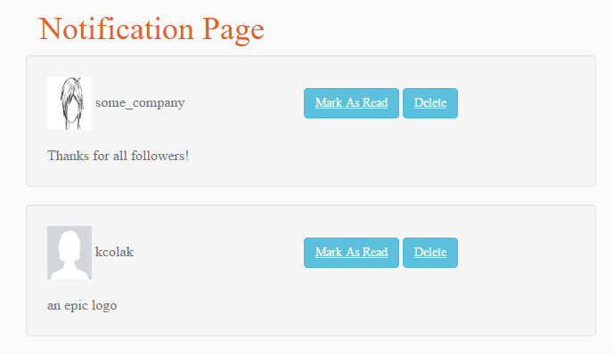

How to update a Notification Status?
~~~~~~~~~~~~~~~~~~~~~~~~~~~~~~~~~~~~~

It is possible to update a notification status by marking it as "Mark as Read" and "Mark as Unread". The default value is of course "Mark as Read" as all newly notifications should be unread.

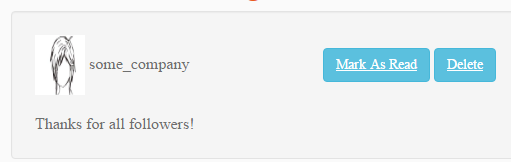

If you click the button "Mark as Read" the status will be updated.

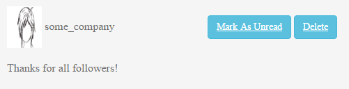

Likewise, there may come a time when a user wishes to mark the notification as unread, as to not forgot it or for another reason. If you click the button "Mark as Unread" then the status will return to its default value.

How to remove a Notification?
~~~~~~~~~~~~~~~~~~~~~~~~~~~~~

If a user wishes to remove a notification from the notification page since after some time the amount may distrub the user, it is possible to remove a notification from the button right to "Mark as ---".

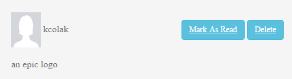

After clicking it, the notification will be removed.

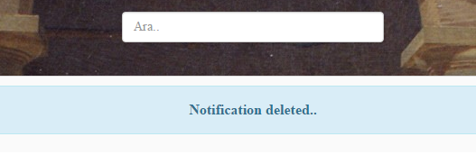