.. sectnum::
Parts Implemented by Ömer Faruk İNCİ
====================================

Sending Message To a Specific User
----------------------------------

Send Message page enables users to send a message to any of the registered users to the website. All the usernames are shown in a clickable list.

Send Message page can be accessed via:

http://itucsdb1621.mybluemix.net/gmessage

How to Send a New Message?
~~~~~~~~~~~~~~~~~~~~~~~~~~

In the Send Message page you can see the text box on the top of the 'Send a new message' button. And also, there is a user list on the top of the text box. After selecting the user from the user list as a reciever and typing your message in the textbox, you can send your message by clicking on the 'Send a new message.' button.

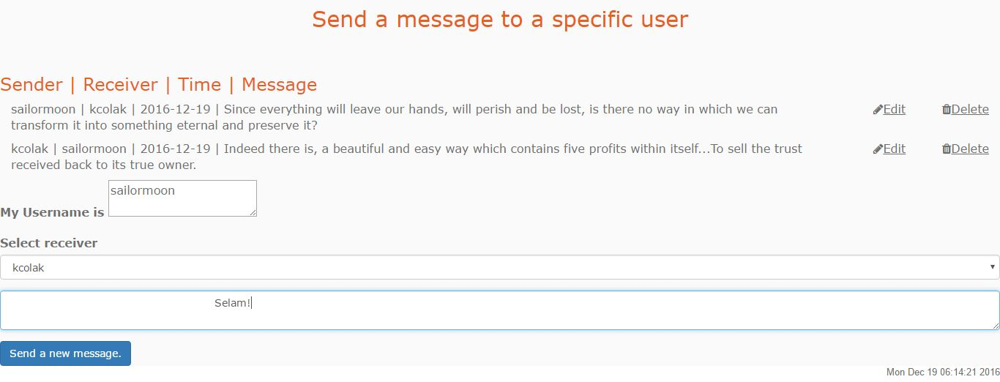

After clicking the 'Send a new message' button. If the sending message operation is succeeded, a page will be appear shows that sending message completed successfully.

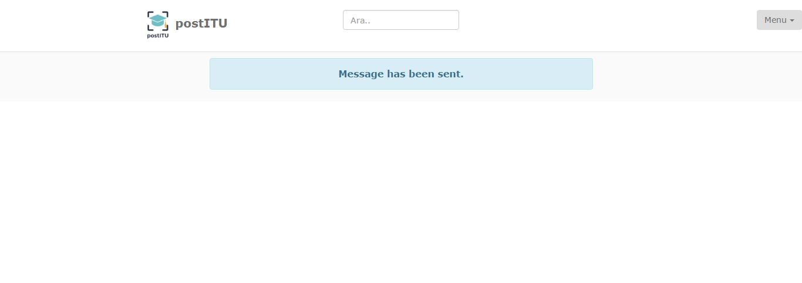

You can see that your message is added successfully by accesing the Send Message page again.

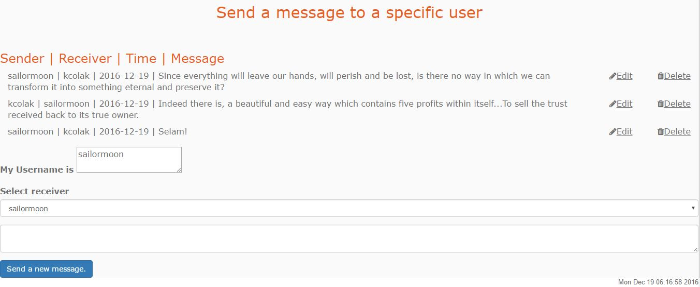

How to Delete an Existing Message?
~~~~~~~~~~~~~~~~~~~~~~~~~~~~~~~~~~

In the Send Message page, you can see that there is a cross icon at the right side of the each message.

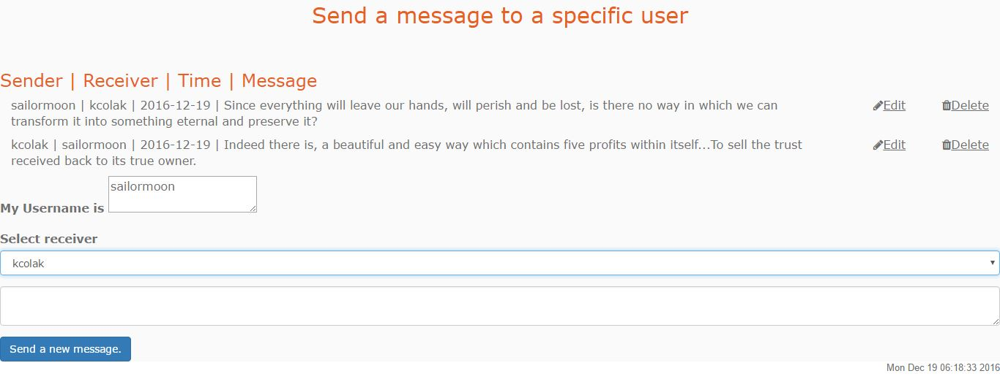

If you click to the cross button, the corresponding message will be deleted and a page will be appear shows that deleting message completed successfully.

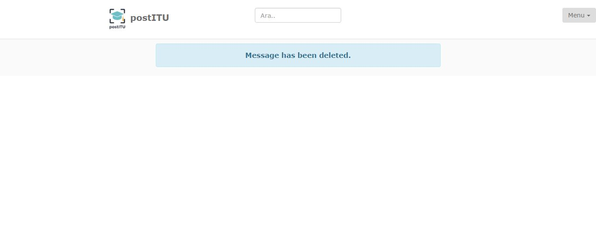

You can see that your message is deleted successfully by accesing the Send Message page again.

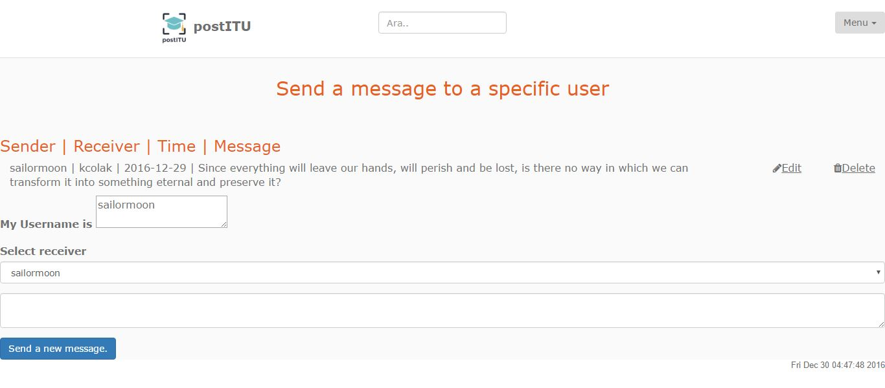

How to Update an Existing Message?
~~~~~~~~~~~~~~~~~~~~~~~~~~~~~~~~~~

In the Send Message page, you can see that there is a pencil icon at the right side of the each message.

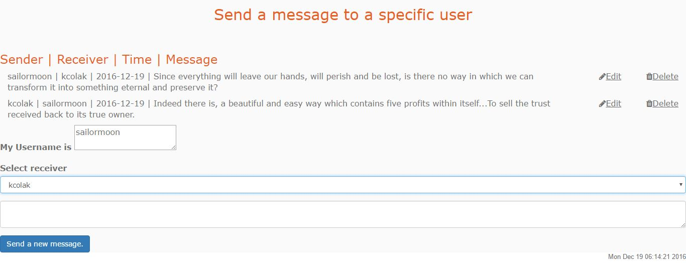

If you click to the pencil button, a textarea appears for entering the new message. And there is a button named 'Update your message.' for updating the old message with the new one.

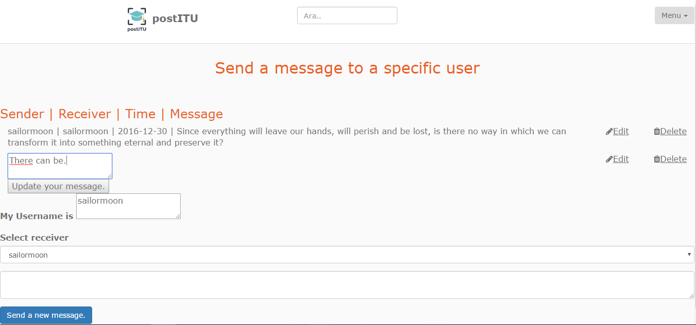

If you click to the 'Update your message.' button, the corresponding message will be updated and a page will be appear shows that updating message completed successfully.

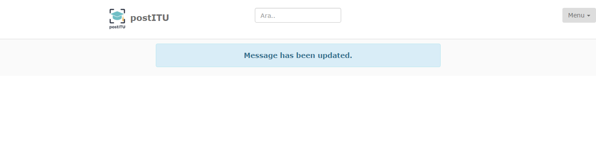

You can see that your message is updated successfully by accesing the Send Message page again.

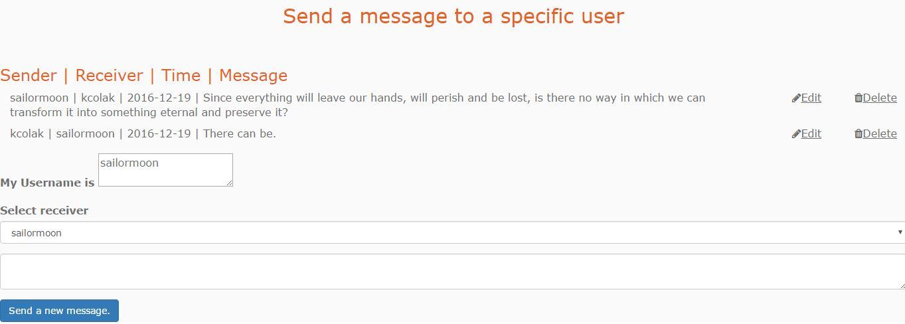

Sending Direct Message
----------------------

Direct Message page enables users to send a message, delete message or update an existing message.

Direct Message page can be accessed via:

http://itucsdb1621.mybluemix.net/dmessage

How to Send a New Message?
~~~~~~~~~~~~~~~~~~~~~~~~~~

In the Direct Message page you can see the text box on the top of the 'Send a new message' button. After typing your message in the textbox and clicking on the 'Send a new message.' button, you can send your message.

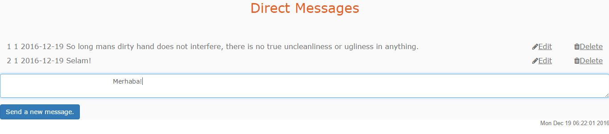

After clicking the 'Send a new message' button. If the sending message operation is succeeded, a page will be appear shows that sending message completed successfully.

You can see that your message is added successfully by accesing the Direct Message page again.

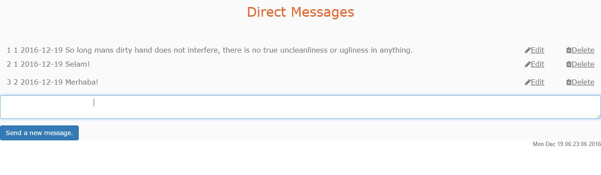

How to Delete an Existing Message?
~~~~~~~~~~~~~~~~~~~~~~~~~~~~~~~~~~

In the Direct Message page, you can see that there is a cross icon at the right side of the each message.

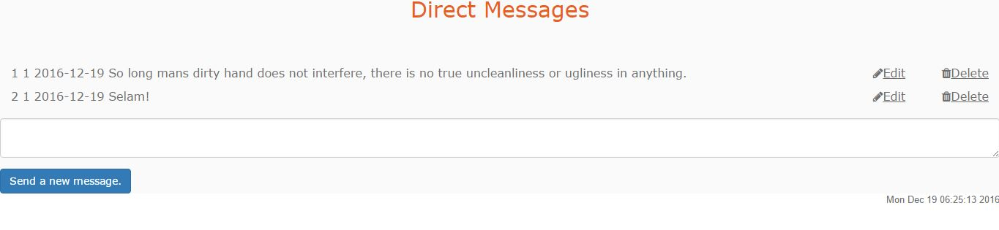

If you click to the cross button, the corresponding message will be deleted and a page will be appear shows that deleting message completed successfully.

You can see that your message is deleted successfully by accesing the Send Message page again.

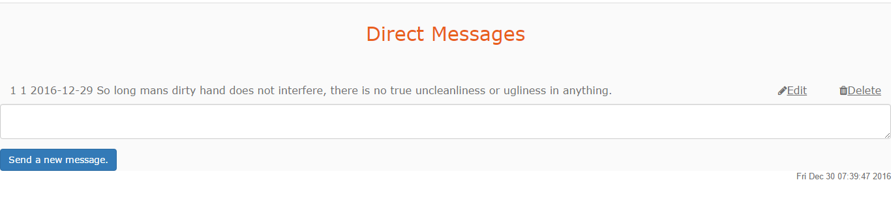

How to Update an Existing Message?
~~~~~~~~~~~~~~~~~~~~~~~~~~~~~~~~~~

In the Dİrect Message page, you can see that there is a pencil icon at the right side of the each message.

If you click to the pencil button, a textarea appears for entering the new message. And there is a button named 'Update your message.' for updating the old message with the new one.

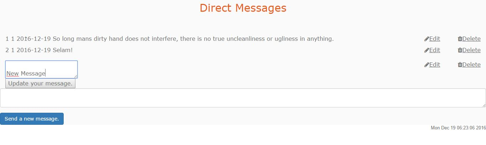

If you click to the 'Update your message.' button, the corresponding message will be updated and a page will be appear shows that updating message completed successfully.

You can see that your message is updated successfully by accesing the Direct Message page again.

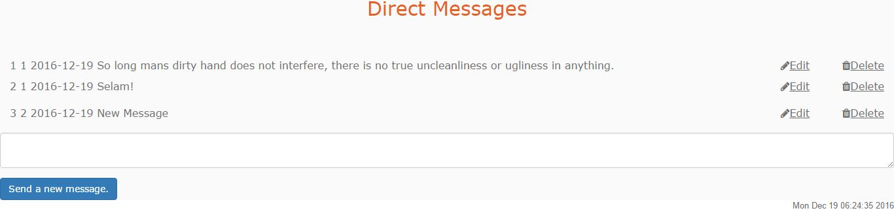
